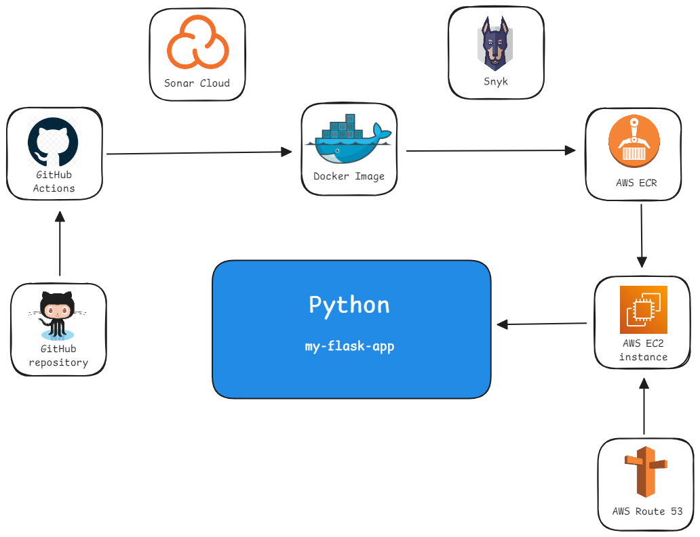

El objetivo de este challenge consiste en crear un servicio Python simple y definir un pipeline CI/CD para el servicio. Utilizando GitHub Actions, Docker, Sonar Cloud, Snyk y servicios de AWS.

  

